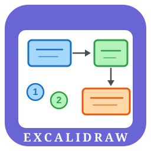
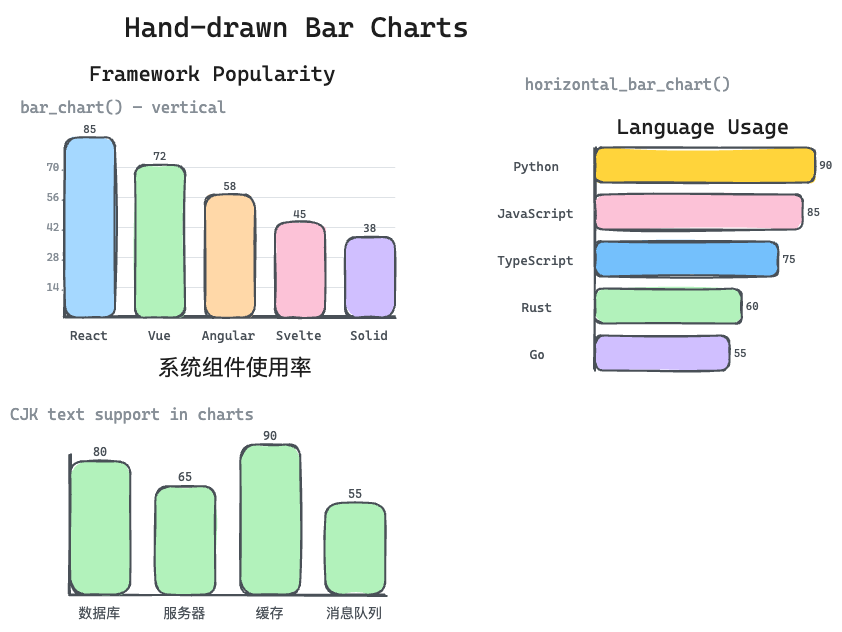

<div align="center">



# Excalidraw Generator

**Generate beautiful Excalidraw diagrams via natural language + Python**

[](https://opensource.org/licenses/MIT)
[](https://python.org)
[](https://github.com)
[](https://excalidraw.com)
[](https://claude.ai/code)

Describe your diagram → Get a production-ready `.excalidraw` file

**v1.2** — SVG converter, bar charts, persistent icon library with vector search

</div>

---

## Highlights

- **12 element builders** — rect, diamond, ellipse, arrow, line, text + labeled variants
- **10 built-in icons** — database, user, cloud, server, gear, document, shield, check, warning, arrow-right
- **SVG converter** — convert any SVG to Excalidraw elements (paths, circles, rects, bezier curves)
- **Bar charts** — hand-drawn vertical and horizontal bar charts with CJK support
- **Icon library** — save, load, and reuse custom icons with persistent storage
- **Vector search** — find icons by description using TF-IDF (zero-dep) or OpenAI embeddings
- **Arrow bindings** — connect arrows to elements with proper Excalidraw bindings
- **Frames & groups** — organize diagrams into named regions and element groups
- **CJK-aware text** — Chinese, Japanese, Korean text centers correctly out of the box
- **3 style presets** — Vivid (rich), Clean (minimal), Sketch (playful)
- **Zero dependencies** — pure Python 3.8+ standard library only
- **Obsidian support** — output `.excalidraw.md` for the Obsidian Excalidraw plugin

---

## Demo Gallery

<div align="center">

</div>

> Vivid (rich & colorful) · Clean (minimal & precise) · Sketch (hand-drawn & bold)

<div align="center">

</div>

> Bar charts — vertical, horizontal, CJK text support

---

## Getting Started

### As a Claude Code Skill

```bash
git clone https://github.com/user/excalidraw-generator ~/.claude/skills/excalidraw-generator
```

Then just ask Claude:

> *"Draw me a Transformer architecture diagram — vivid style, hachure fill, roughness 1, Helvetica font"*

### As a Python Library

```python
from core.engine import (
    labeled_rect, labeled_diamond, labeled_ellipse,
    arrow, bind_arrow, group, frame,
    save_excalidraw
)
from core.icons import icon

# Decision flow
start = labeled_ellipse(200, 20, 100, 50, "Start", fill="#d0f0c0")
step  = labeled_rect(150, 100, 200, 60, "Process")
dec   = labeled_diamond(160, 200, 160, 100, "Valid?")
end   = labeled_ellipse(200, 340, 100, 50, "End", fill="#d0f0c0")

a1 = bind_arrow(arrow(250, 70, 0, 30), start[0], step[0])
a2 = bind_arrow(arrow(250, 160, 0, 40), step[0], dec[0])
a3 = bind_arrow(arrow(240, 300, 0, 40), dec[0], end[0])

elements = [*start, *step, *dec, *end, a1, a2, a3]
save_excalidraw("flow.excalidraw", elements)
```

---

## API Reference

### Element Builders

| Function | Description |
|----------|-------------|
| `rect(x, y, w, h)` | Plain rectangle |
| `labeled_rect(x, y, w, h, label)` | Rectangle with auto-centered text |
| `labeled_diamond(x, y, w, h, label)` | Diamond decision node with text |
| `labeled_ellipse(x, y, w, h, label)` | Ellipse/circle with text |
| `text_standalone(cx, cy, txt)` | Standalone centered text |
| `arrow(x, y, dx, dy)` | Arrow with arrowhead |
| `ellipse(x, y, w, h)` | Circle or ellipse |
| `diamond(x, y, w, h)` | Diamond shape |
| `line(x, y, dx, dy)` | Line segment |
| `group(elements)` | Group elements with shared groupId |
| `frame(x, y, w, h, name)` | Named frame/region |
| `image_embed(x, y, w, h, base64_data)` | Embedded image element |
| `bind_arrow(arrow_el, start, end)` | Bind arrow to start/end elements |
| `numbered_circle(cx, cy, num)` | Numbered badge |

### SVG Converter

| Function | Description |
|----------|-------------|
| `svg_to_elements(svg_string, x, y, scale)` | Convert SVG string to Excalidraw elements |
| `svg_file_to_elements(filepath, x, y, scale)` | Convert SVG file to Excalidraw elements |

Supports path commands M/L/H/V/C/S/Q/T/A/Z, SVG elements `<path>`/`<rect>`/`<circle>`/`<ellipse>`/`<line>`/`<polygon>`, Bezier tessellation, RDP simplification, and shape classification.

### Charts

| Function | Description |
|----------|-------------|
| `bar_chart(x, y, data, title, ...)` | Vertical bar chart |
| `horizontal_bar_chart(x, y, data, title, ...)` | Horizontal bar chart |

```python
from core.charts import bar_chart

elements = bar_chart(
    x=50, y=100,
    data={"React": 85, "Vue": 72, "Angular": 58},
    title="Framework Popularity",
    bar_color="#a5d8ff",
    show_values=True,
    show_grid=True,
)
```

### Icon Library (Built-in)

| Icon Name | Description |
|-----------|-------------|
| `database` | Database cylinder — data storage |
| `user` | Person silhouette — users, actors |
| `cloud` | Cloud shape — cloud services |
| `server` | Server rack — hosting, infrastructure |
| `gear` | Gear/cog — settings, configuration |
| `document` | Document with fold — files, pages |
| `shield` | Shield — security, protection |
| `arrow-right` | Right-pointing arrow — direction |
| `check` | Checkmark — approval, completion |
| `warning` | Warning triangle — alerts, caution |

### Icon Library (Persistent & Searchable)

| Function | Description |
|----------|-------------|
| `save_icon(name, elements, description, tags)` | Save icon to `~/.excalidraw-gen/icons/` |
| `load_icon(name, x, y, scale)` | Load and reposition icon |
| `delete_icon(name)` | Remove icon from library |
| `list_library_icons()` | List all saved icons |
| `find_icons(query, limit)` | Search by description (TF-IDF or embeddings) |

```python
from core.icon_library import save_icon, load_icon, find_icons

# Save with description for searchability
save_icon("my-server", elements, description="Server rack with LED indicators",
          tags=["server", "hardware"])

# Find by description
results = find_icons("server infrastructure")
server = load_icon(results[0]["name"], x=200, y=100)
```

### Output

| Function | Description |
|----------|-------------|
| `save_excalidraw(filepath, elements)` | `.excalidraw` JSON |
| `save_obsidian_md(filepath, elements)` | `.excalidraw.md` for Obsidian |

---

## Styles

Three style presets control **content richness** and **color scheme**:

| | **Vivid** | **Clean** | **Sketch** |
|---|---|---|---|
| **Content** | Badges, sub-cards, grids, annotations | Just boxes, arrows, labels | Big cards, playful elements |
| **Colors** | 7-color vibrant palette | Black & white only | Warm multi-color |
| **Elements** | Many (50-70) | Few (30-45) | Medium (30-40) |

### User-Selectable Options

Fill style, roughness, and font are **independent of style** — mix and match freely:

| Option | Values | Effect |
|--------|--------|--------|
| **Fill Style** | `solid` / `hachure` / `cross-hatch` | Solid color / diagonal lines / cross lines |
| **Roughness** | `0` / `1` / `2` | Precise / slight wobble / rough hand-drawn |
| **Font** | `1` / `2` / `3` | Virgil (handwritten) / Helvetica (clean) / Cascadia (code) |

---

## CJK Text Support

Built-in CJK-aware width estimation ensures Chinese, Japanese, and Korean text centers correctly in diagrams. Use `font_family=5` for CJK-optimized fonts. No extra configuration needed.

---

## Icon Search

### TF-IDF Search (Default, Zero Dependencies)

Works offline with no external packages. Tokenizes icon descriptions and tags, builds TF-IDF vectors, ranks by cosine similarity.

### Embedding Search (Optional, Requires OpenAI API)

Set `OPENAI_API_KEY` environment variable and install `openai` package. Generates text embeddings for semantic search.

```python
results = find_icons("database storage system", use_embeddings=True)
```

---

## Custom Styles

Create a YAML file in `~/.excalidraw-gen/styles/`:

```yaml
name: "Dark Mode"
colors:
  background: "#1a1a2e"
  primary: "#4A90E2"
  accent: "#E67E22"
  text: "#e0e0e0"
  border: "#555555"
typography:
  title_size: 24
  body_size: 14
  label_size: 11
layout:
  border_width: 2
  border_radius: true
  default_gap: 50
```

---

## Output Formats

### `.excalidraw`
Standard JSON — works with [excalidraw.com](https://excalidraw.com), VS Code extension, etc.

### `.excalidraw.md`
Markdown wrapper for the [Obsidian Excalidraw plugin](https://github.com/zsviczian/obsidian-excalidrawplugin).

---

## Project Structure

```
excalidraw-generator/
├── SKILL.md                  ← Claude Code skill entry point
├── README.md
├── assets/
│   ├── icon.svg              ← Logo
│   ├── demo-gallery.png      ← Three styles side by side
│   └── how-it-works.png      ← Pipeline flowchart
├── core/
│   ├── __init__.py
│   ├── engine.py             ← Element builders & output
│   ├── icons.py              ← Built-in icon library (10 icons)
│   ├── svg_converter.py      ← SVG to Excalidraw conversion
│   ├── charts.py             ← Bar chart builder
│   └── icon_library.py       ← Persistent icon library & search
├── styles/
│   ├── __init__.py
│   ├── base.py               ← StyleConfig dataclass
│   ├── conference.py         ← Vivid preset
│   ├── journal.py            ← Clean preset
│   ├── ppt.py                ← Sketch preset
│   └── loader.py             ← Style resolver
├── prompts/
│   ├── vivid-prompt.md
│   ├── clean-prompt.md
│   └── sketch-prompt.md
├── tests/
│   ├── test_smoke.py
│   ├── test_labeled_shapes.py
│   ├── test_group_frame.py
│   ├── test_image_arrow.py
│   ├── test_icons.py
│   ├── test_svg_converter.py ← SVG converter tests (44)
│   ├── test_charts.py        ← Bar chart tests (15)
│   └── test_icon_library.py  ← Icon library + search tests (24)
└── examples/
    ├── generate_style_v3.py
    ├── generate_p1_demos.py
    ├── generate_p2_demos.py  ← P2 feature showcase
    └── *.excalidraw           ← Example outputs
```

---

## License

[MIT](LICENSE)

<div align="center">
Made with ♥ for the Claude Code & Excalidraw communities
</div>
