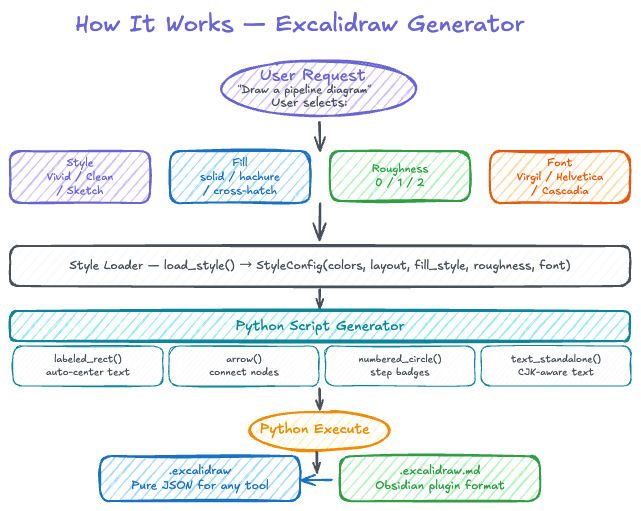

<div align="center">


# Excalidraw Generator

**Generate beautiful Excalidraw diagrams via natural language + Python**

[](https://opensource.org/licenses/MIT)
[](https://python.org)
[](https://github.com)
[](https://excalidraw.com)

Describe your diagram → Get a production-ready `.excalidraw` file

</div>

---

## Demo Gallery

<div align="center">

</div>

> Vivid (rich & colorful) · Clean (minimal & precise) · Sketch (hand-drawn & bold)

---

## How It Works

<div align="center">

</div>

> This flowchart was generated by the skill itself — dogfooding!

---

## Styles

Three style presets control **content richness** and **color scheme**:

| | **Vivid** | **Clean** | **Sketch** |
|---|---|---|---|
| **Content** | Badges, sub-cards, grids, annotations | Just boxes, arrows, labels | Big cards, playful elements |
| **Colors** | 7-color vibrant palette | Black & white only | Warm multi-color |
| **Elements** | Many (50-70) | Few (30-45) | Medium (30-40) |

### User-Selectable Options

Fill style, roughness, and font are **independent of style** — mix and match freely:

| Option | Values | Effect |
|--------|--------|--------|
| **Fill Style** | `solid` / `hachure` / `cross-hatch` | Solid color / diagonal lines / cross lines |
| **Roughness** | `0` / `1` / `2` | Precise / slight wobble / rough hand-drawn |
| **Font** | `1` / `2` / `3` | Virgil (handwritten) / Helvetica (clean) / Cascadia (code) |

> Example: "Clean style + hachure fill + roughness 2 + Virgil font" = minimal content with hand-drawn texture

---

## Getting Started

### As a Claude Code Skill

```bash
git clone https://github.com/user/excalidraw-generator ~/.claude/skills/excalidraw-generator
```

Then just ask Claude:

> *"Draw me a Transformer architecture diagram — vivid style, hachure fill, roughness 1, Helvetica font"*

### As a Python Library

```python
from core.engine import labeled_rect, arrow, save_excalidraw

elements = []

elements += labeled_rect(50, 50, 200, 80, "Input Layer",
              fill="#a5d8ff", stroke="#1971c2", sw=2, fs=16,
              fill_style="solid", roughness=1, font_family=2)
elements.append(arrow(250, 90, 50, 0))
elements += labeled_rect(300, 50, 200, 80, "Hidden Layer",
              fill="#b2f2bb", stroke="#2f9e44", sw=2, fs=16)
elements.append(arrow(500, 90, 50, 0))
elements += labeled_rect(550, 50, 200, 80, "Output",
              fill="#ffd8a8", stroke="#e8590c", sw=2, fs=16)

save_excalidraw("diagram.excalidraw", elements)
```

---

## API Reference

### Element Builders

| Function | Description |
|----------|-------------|
| `rect(x, y, w, h)` | Plain rectangle |
| `labeled_rect(x, y, w, h, label)` | Rectangle with auto-centered text |
| `text_standalone(cx, cy, txt)` | Standalone centered text |
| `arrow(x, y, dx, dy)` | Arrow with arrowhead |
| `ellipse(x, y, w, h)` | Circle or ellipse |
| `diamond(x, y, w, h)` | Diamond shape |
| `line(x, y, dx, dy)` | Line segment |
| `numbered_circle(cx, cy, num)` | Numbered badge |

### Common Parameters

Every shape builder accepts:

| Parameter | Values | Default |
|-----------|--------|---------|
| `fill_style` | `"solid"`, `"hachure"`, `"cross-hatch"` | `"solid"` |
| `roughness` | `0`, `1`, `2` | `1` |
| `font_family` | `1` (Virgil), `2` (Helvetica), `3` (Cascadia) | `3` |

### Output

| Function | Description |
|----------|-------------|
| `save_excalidraw(filepath, elements)` | `.excalidraw` JSON |
| `save_obsidian_md(filepath, elements)` | `.excalidraw.md` for Obsidian |

---

## CJK Text Support

Built-in CJK-aware width estimation ensures Chinese, Japanese, and Korean text centers correctly in diagrams. No extra configuration needed.

---

## Custom Styles

Create a YAML file in `~/.excalidraw-gen/styles/`:

```yaml
name: "Dark Mode"
colors:
  background: "#1a1a2e"
  primary: "#4A90E2"
  accent: "#E67E22"
  text: "#e0e0e0"
  border: "#555555"
  muted: "#888888"
typography:
  title_size: 24
  body_size: 14
  label_size: 11
layout:
  border_width: 2
  border_radius: true
  default_gap: 50
```

Then: `"Draw my diagram in dark-mode style"`

---

## Output Formats

### `.excalidraw`
Standard JSON — works with [excalidraw.com](https://excalidraw.com), VS Code extension, etc.

### `.excalidraw.md`
Markdown wrapper for the [Obsidian Excalidraw plugin](https://github.com/zsviczian/obsidian-excalidrawplugin).

---

## Project Structure

```
excalidraw-generator/
├── SKILL.md                  ← Claude Code skill entry point
├── README.md
├── assets/
│   ├── icon.svg              ← Logo
│   ├── icon.png              ← Logo (PNG)
│   ├── demo-gallery.png      ← Three styles side by side
│   └── how-it-works.png      ← Pipeline flowchart
├── core/
│   ├── __init__.py
│   └── engine.py             ← Element builders & output
├── styles/
│   ├── __init__.py
│   ├── base.py               ← StyleConfig dataclass
│   ├── conference.py         ← Vivid preset
│   ├── journal.py            ← Clean preset
│   ├── ppt.py                ← Sketch preset
│   └── loader.py             ← Style resolver
├── prompts/
│   ├── vivid-prompt.md
│   ├── clean-prompt.md
│   └── sketch-prompt.md
└── examples/
    ├── generate_style_v3.py  ← Demo generation script
    ├── demo-vivid.excalidraw
    ├── demo-clean.excalidraw
    └── demo-sketch.excalidraw
```

---

## License

[MIT](LICENSE)

<div align="center">
Made with ♥ for the Claude Code & Excalidraw communities
</div>
