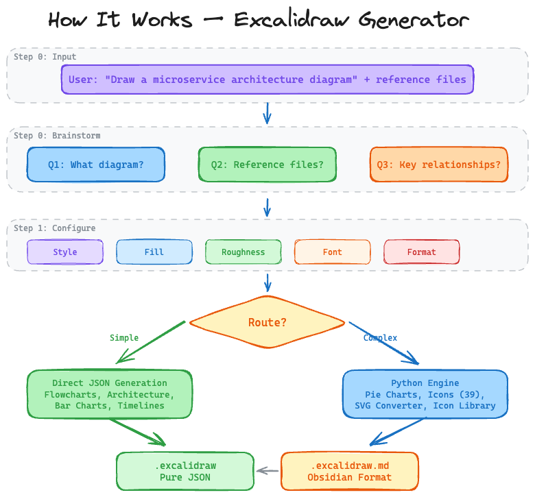
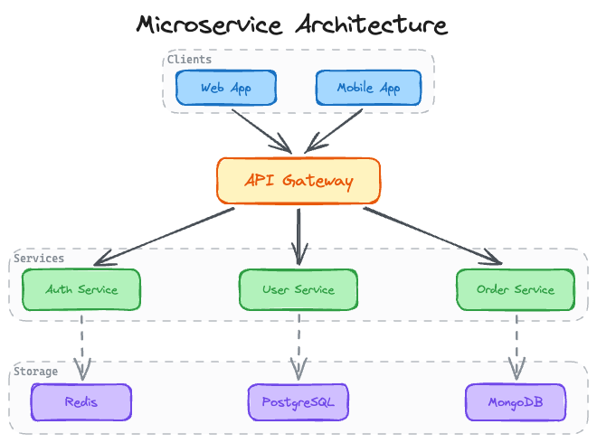
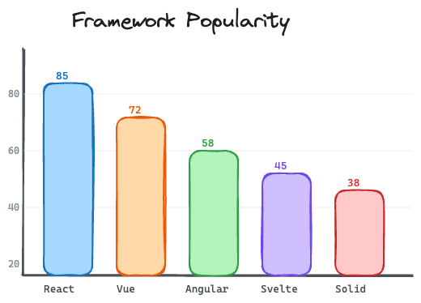
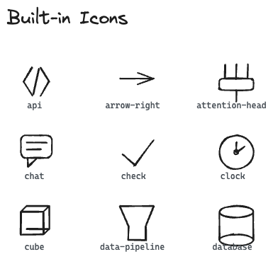
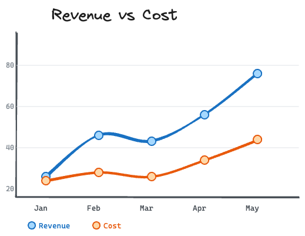
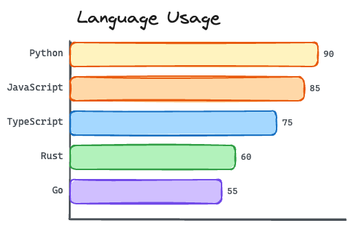
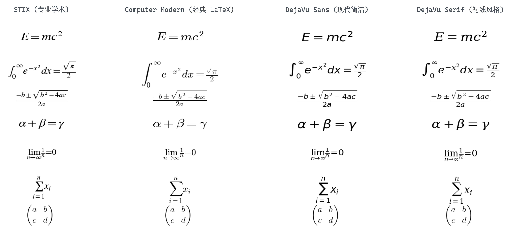
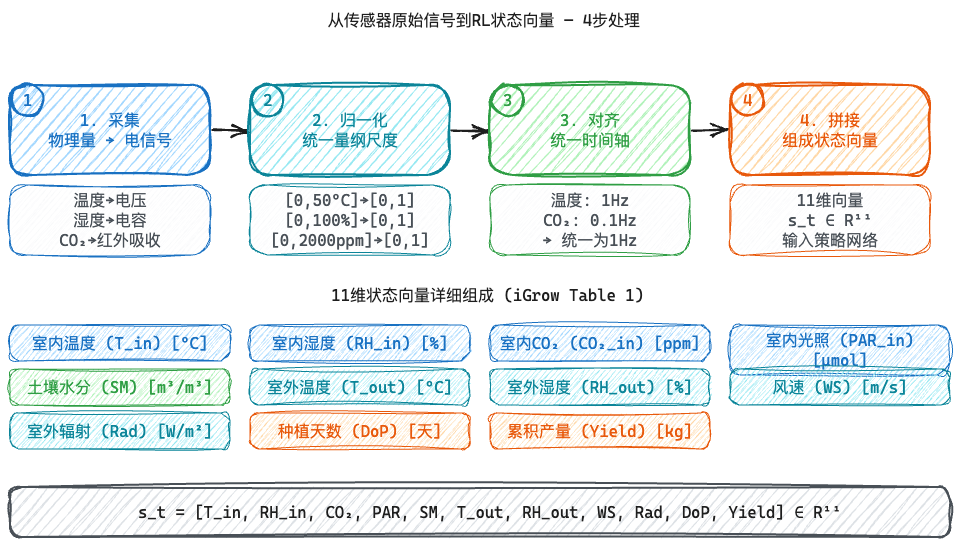
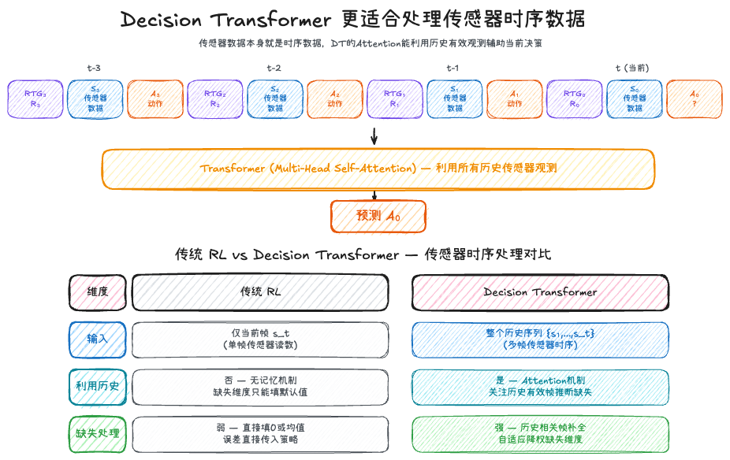
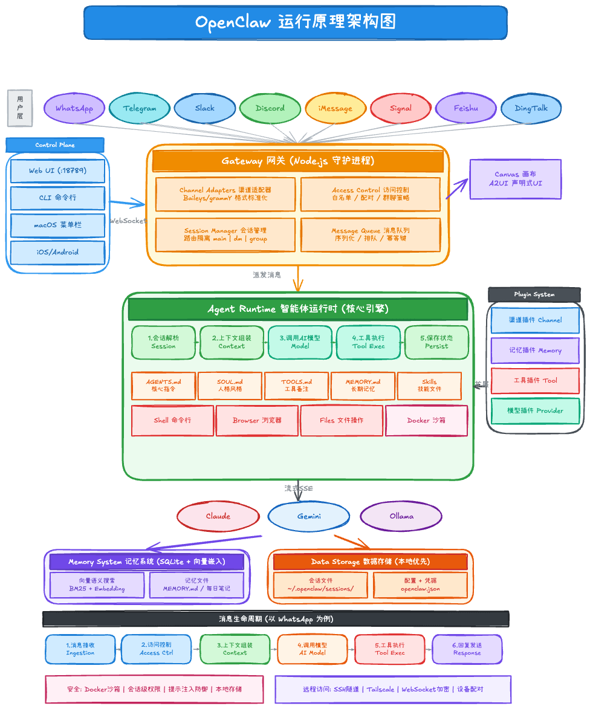

<div align="center">

# ✏️ Excalidraw Generator

**[English](README.md)** | **[中文](README_CN.md)**

**AI 驱动的 Excalidraw 图表生成器，适用于 Claude Code**

直接生成高质量的流程图、架构图、图表等 — 输出标准 Excalidraw JSON。

[](https://python.org)
[](LICENSE)
[](https://github.com/AlanYu04/excalidraw-generator-skill)

`39 个内置图标` · `4 种图表类型` · `3 种样式预设` · `CJK 支持` · `LaTeX 公式` · `图表管线` · `布局验证` · `零依赖`

</div>

---

## ✨ 功能特性

| | 功能 | 说明 |
|---|------|------|
| 📐 | **元素构建器** | 矩形、椭圆、菱形、箭头、线条、文本 — 支持 `containerId` 绑定 |
| 📊 | **4 种图表** | 柱状图、横向柱状图、折线图、饼图（含甜甜圈模式） |
| 🎨 | **39 个内置图标** | 通用 + ML/AI + 工具类图标集 |
| 🤖 | **AI 图标生成** | 通过 Gemini API 生成自定义图标 |
| 🎭 | **3 种样式预设** | Vivid、Clean、Sketch + 自定义 YAML 样式 |
| 🔄 | **SVG 转换** | SVG 转 Excalidraw，支持贝塞尔曲线和形状分类 |
| 📚 | **图标库** | 持久化存储，支持 TF-IDF 搜索或 OpenAI 向量搜索 |
| 🇨🇳 | **CJK 支持** | 中文、日文、韩文文本渲染 |
| 📏 | **LaTeX 公式** | Mathtext + usetex 回退，4 种字体可选 |
| 🔗 | **图表管线** | 确定性管线：规范 → 验证 → 渲染 → 修复 |
| 🔍 | **布局验证** | 检测重叠、箭头绑定问题、间距不一致 |
| 📏 | **布局助手** | 定位工具和 `auto_labeled_rect` 自动尺寸 |
| 💾 | **双格式输出** | `.excalidraw`（JSON）或 `.excalidraw.md`（Obsidian） |

> \* AI 图标生成需要 Gemini API 密钥；YAML 样式需要 PyYAML

---

### 🔧 工作原理



### 🖼️ 效果展示

| 架构图 | 图表 | 图标 |
|:---:|:---:|:---:|
|  |  |  |
|  |  | |

### 📐 LaTeX 公式渲染

将 LaTeX 公式渲染为 PNG 图片，支持 4 种字体选择。简单数学公式使用 matplotlib mathtext；复杂环境如 `pmatrix` / `array` 自动回退到系统 LaTeX + amsmath。



```python
from core.latex import formula

# 简单公式（使用 mathtext 渲染）
elements = formula(r"E = mc^2", x=100, y=50, font_size=20)

# 复杂公式含矩阵（自动回退到 usetex + amsmath）
elements = formula(r"\begin{pmatrix} a & b \\ c & d \end{pmatrix}", x=100, y=100, font_size=14)

# 全局修改默认字体
import core.latex
core.latex.DEFAULT_FONTSET = "stix"  # 或 "cm", "dejavusans", "dejavuserif"

# 或按公式单独设置
elements = formula(r"\alpha + \beta = \gamma", x=100, y=150, font_size=20, fontset="stix")
```

支持的 mathtext 语法：分数、积分、求和、极限、希腊字母、根号、上下标。

不支持 mathtext（自动回退 usetex）：`\begin{pmatrix}`、`\begin{array}`、`\begin{cases}`、`\begin{smallmatrix}`。

注意：`usetex` 模式需要安装 LaTeX（`pdflatex` + `amsmath` 包），且忽略 `fontset` 参数。

### 🚀 实际案例

| 传感器数据处理 | Decision Transformer | OpenClaw 架构 |
|:---:|:---:|:---:|
|  |  |  |

---

## 环境准备

### 1. 安装 Obsidian（推荐）

[Obsidian](https://obsidian.md) 是一款免费笔记工具，原生支持 Excalidraw 插件。

1. 下载：https://obsidian.md/download
2. 创建或打开一个 Vault（笔记库）

### 2. 安装 Excalidraw 插件

1. 打开 Obsidian → 设置 → 第三方插件
2. 关闭安全模式（如果还没关）
3. 点击浏览 → 搜索 "Excalidraw"
4. 安装 **Excalidraw**（作者：Zsolt Viczián）
5. 启用插件

### 3. 查看生成的图表

- 将 `.excalidraw` 文件放入 Vault 目录
- 在 Obsidian 中点击即可打开编辑
- 或访问 https://excalidraw.com 在线打开

### 不用 Obsidian？

`.excalidraw` 文件是标准 JSON，也可以用：
- [excalidraw.com](https://excalidraw.com) — 在线编辑器
- VS Code Excalidraw 扩展
- 任何支持 Excalidraw 格式的工具

---

## 快速开始

### 作为 Claude Code Skill

```bash
git clone https://github.com/AlanYu04/excalidraw-generator-skill ~/.claude/skills/excalidraw-generator
```

然后直接对 Claude 说：

> *"画一个 Transformer 架构图 — vivid 风格，hachure 填充，roughness 1"*

### 作为 Python 库

```python
from core.engine import labeled_rect, labeled_ellipse, arrow, bind_arrow, save

# 1. 创建形状
start = labeled_ellipse(200, 20, 100, 50, "开始", fill="#d0f0c0")
step  = labeled_rect(150, 100, 200, 60, "处理数据")
end   = labeled_ellipse(200, 200, 100, 50, "结束", fill="#d0f0c0")

# 2. 用箭头连接
a1 = bind_arrow(arrow(250, 70, 0, 30), start[0], step[0])
a2 = bind_arrow(arrow(250, 160, 0, 40), step[0], end[0])

# 3. 保存
elements = [*start, *step, *end, a1, a2]
save("flow.excalidraw", elements)
```

---

## 元素构建器

| 函数 | 签名 | 返回值 |
|------|------|--------|
| `rect` | `rect(x, y, w, h, fill, stroke, sw, roughness, fill_style, stroke_style)` | `dict` |
| `ellipse` | `ellipse(x, y, w, h, fill, stroke, sw, roughness, fill_style)` | `dict` |
| `diamond` | `diamond(x, y, w, h, fill, stroke, sw, roughness, fill_style)` | `dict` |
| `labeled_rect` | `labeled_rect(x, y, w, h, label, fill, stroke, sw, fs, label_color, roughness, font_family, fill_style, stroke_style)` | `[rect, text]` |
| `labeled_ellipse` | `labeled_ellipse(x, y, w, h, label, fill, stroke, sw, fs, label_color, roughness, font_family, fill_style)` | `[ellipse, text]` |
| `labeled_diamond` | `labeled_diamond(x, y, w, h, label, fill, stroke, sw, fs, label_color, roughness, font_family, fill_style)` | `[diamond, text]` |
| `auto_labeled_rect` | `auto_labeled_rect(x, y, label, padding=10, fs=20, min_width=0, min_height=0, **kwargs)` | `[rect, text]` |
| `text_standalone` | `text_standalone(cx, cy, txt, fs=20, color, font_family=5, roughness=0, text_align="center", max_width=None)` | `dict` |
| `arrow` | `arrow(x, y, dx=0, dy=0, *, x2=None, y2=None, stroke, sw, roughness)` | `dict` |
| `line` | `line(x, y, dx=0, dy=0, *, x2=None, y2=None, stroke, sw, roughness)` | `dict` |
| `numbered_circle` | `numbered_circle(cx, cy, num, fill, stroke)` | `[ellipse, text]` |
| `frame` | `frame(x, y, w, h, name="Frame", stroke, sw)` | `dict` |
| `group` | `group(elements)` | `list[dict]` |
| `bind_arrow` | `bind_arrow(arrow_el, start_el, end_el, gap=2, start_focus=None, end_focus=None)` | `dict` |
| `connect` | `connect(start_el, end_el, stroke, sw, roughness, gap=8, elbowed=False, start_focus=None, end_focus=None)` | `dict` |
| `image_embed` | `image_embed(x, y, w, h, base64_data, mime="image/png")` | `(element, files)` |

`text_standalone` 支持 `text_align`（"center"、"left"、"right"）和 `max_width` — 设置后字体大小会自动缩小直到文本适合宽度。
`bind_arrow()` 和 `connect()` 默认会根据几何关系推断边缘 focus，避免多根箭头塌到宽目标的中心点。

---

## 布局助手

定位工具和自动尺寸：

```python
from core.engine import below, right_of, above, auto_labeled_rect

y2 = below(y=100, h=60, gap=15)    # y2 = 175
x2 = right_of(x=50, w=200, gap=10) # x2 = 260
y_above = above(y=100, gap=10)     # y_above = 90

# 自动尺寸矩形 — 宽高根据文本内容计算
els = auto_labeled_rect(0, 0, "你好世界", padding=10, fs=16, min_width=120)
```

### 布局验证

检测重叠、箭头绑定问题和间距不一致：

```python
from core.engine import check_overlaps, check_arrow_bindings, check_spacing, verify_layout

report = verify_layout(elements)
# {"status": "PASS"|"WARN"|"FAIL", "overlaps": [...], "arrow_issues": [...], "spacing_issues": [...], ...}

# 或单独检查
overlaps = check_overlaps(elements)            # 检测重叠形状
arrow_issues = check_arrow_bindings(elements)  # 检测断开/未绑定箭头
spacing = check_spacing(elements)              # 检测不一致间距
```

---

## 图表类型

### 柱状图

```python
from core.charts import bar_chart

elements = bar_chart(
    x=50, y=100,
    data={"React": 85, "Vue": 72, "Angular": 58},
    title="框架流行度",
    bar_color="#a5d8ff",
    show_values=True,
    show_grid=True,
)
```

### 横向柱状图

```python
from core.charts import horizontal_bar_chart

elements = horizontal_bar_chart(
    x=50, y=50,
    data={"训练": 120, "推理": 85, "评估": 45},
    title="耗时分布（分钟）",
)
```

### 折线图（多系列）

```python
from core.charts import line_chart

elements = line_chart(
    x=50, y=50,
    data={"收入": [10, 25, 35, 50, 70], "成本": [8, 15, 20, 30, 35]},
    labels=["Q1", "Q2", "Q3", "Q4", "Q5"],
    title="收入 vs 成本",
    show_points=True, show_legend=True,
)
```

### 饼图（含甜甜圈模式）

```python
from core.charts import pie_chart

elements = pie_chart(
    x=100, y=100,
    data={"移动端": 45, "桌面端": 35, "平板": 20},
    title="流量来源",
    donut=True, donut_radius=50, show_percentages=True,
)
```

---

## 内置图标（39 个）

### 通用（10）

| 图标 | 名称 | 说明 |
|------|------|------|
| 圆柱 | `database` | 数据存储 |
| 人形 | `user` | 用户、角色 |
| 云 | `cloud` | 云服务 |
| 机架 | `server` | 基础设施 |
| 齿轮 | `gear` | 设置、配置 |
| 文件 | `document` | 文件、页面 |
| 盾牌 | `shield` | 安全 |
| 箭头 | `arrow-right` | 方向 |
| 勾选 | `check` | 批准、完成 |
| 三角 | `warning` | 警告、注意 |

### ML/AI（12）

| 图标 | 名称 | 说明 |
|------|------|------|
| 方块 | `transformer-block` | 多头注意力 + FFN |
| 箭头 | `attention-head` | Q, K, V 汇聚 |
| 网格 | `embedding-layer` | 嵌入矩阵 |
| 堆叠 | `feedforward` | 两层 FFN |
| 编码 | `encoder` | 编码器堆栈 |
| 解码 | `decoder` | 解码器堆栈 |
| 曲线 | `loss-function` | 下降损失曲线 |
| 螺旋 | `optimizer` | 梯度下降 |
| 芯片 | `gpu` | GPU / 加速器 |
| 机器人 | `robot` | AI 智能体 |
| 大脑 | `brain` | 智能 |
| 节点 | `neural-net` | 三层网络 |

### 工具（17）

| 图标 | 名称 | 说明 |
|------|------|------|
| 立方体 | `cube` | 通用对象 |
| 漏斗 | `data-pipeline` | ETL、数据处理 |
| 矩阵 | `matrix` | 二维矩阵 |
| 锁 | `lock` | 安全、认证 |
| 信号 | `wifi` | 连接 |
| 心形 | `heart` | 健康、收藏 |
| 星形 | `star` | 评分、收藏 |
| 闪电 | `lightning` | 速度、能量 |
| 时钟 | `clock` | 时间、调度 |
| 放大镜 | `magnifier` | 搜索、检查 |
| 火焰 | `fire` | 热门、趋势 |
| 地球 | `globe` | 全球、网络 |
| 气泡 | `chat` | 消息 |
| 括号 | `api` | API 端点 |
| 终端 | `terminal` | CLI、控制台 |
| 文件夹 | `folder` | 目录 |
| 钥匙 | `key` | 认证 |

```python
from core.icons import icon, list_icons

# 查看所有图标
print(list_icons())

# 放置图标
elements = icon("database", x=100, y=50, scale=1.0, stroke="#1e1e1e", sw=2, roughness=1)
```

### 图标库（持久化 & 可搜索）

保存、加载和搜索自定义图标，存储在 `~/.excalidraw-gen/icons/`。

| 函数 | 说明 |
|------|------|
| `save_icon(name, elements, description, tags, source)` | 保存图标到库 |
| `load_icon(name, x=0, y=0, scale=1.0)` | 加载并重定位图标 |
| `delete_icon(name)` | 删除图标 |
| `list_library_icons()` | 列出所有已保存图标 |
| `find_icons(query, limit=5, use_embeddings=False)` | 按描述搜索（TF-IDF 或 OpenAI 向量） |
| `import_excalidrawlib(filepath, descriptions, tags_map, prefix)` | 从 `.excalidrawlib` 文件导入 |

```python
from core.icon_library import save_icon, load_icon, find_icons

save_icon("my-server", elements, description="带 LED 指示灯的服务器",
          tags=["server", "hardware"])

results = find_icons("服务器 基础设施")
server = load_icon(results[0]["name"], x=200, y=100)
```

### AI 图标生成

通过 Gemini API 生成图标，自动 SVG 转 Excalidraw 转换，支持 PNG 回退。

| 函数 | 说明 |
|------|------|
| `configure(api_url, api_key, model)` | 保存 Gemini API 配置 |
| `generate_icon(description, x, y, scale, stroke, sw, roughness, prompt)` | 生成图标为 Excalidraw 元素 |
| `generate_icon_svg(description, prompt, model)` | 生成原始 SVG 字符串 |
| `generate_and_save(name, description, tags, **kwargs)` | 生成并保存到库 |

```python
from core.ai_icons import configure, generate_icon, generate_and_save

configure(api_url="https://generativelanguage.googleapis.com/v1beta",
          api_key="YOUR_KEY", model="gemini-2.0-flash")

elements = generate_icon("kubernetes pod", x=100, y=200, scale=1.5)
generate_and_save("k8s-pod", "Kubernetes pod 图标", tags=["k8s", "container"])
```

---

## 样式预设

| 预设 | 字体 | 粗糙度 | 填充 | 圆角 | 适用场景 |
|------|------|--------|------|------|---------|
| **Vivid** | Helvetica (2) | 0 | solid | 无 | 会议/学术风格 |
| **Clean** | Helvetica (2) | 0 | solid | 无 | 简约精确 |
| **Sketch** | Virgil (1) | 1 | hachure | 有 | 手绘风格 |

```python
from styles import load_style, vivid_style, clean_style, sketch_style

style = load_style("vivid")
fill, stroke = style.get_color_pair("primary")  # ("#DCEAF6", "#2B5B84")
fill, stroke = style.get_color_pair("danger")    # ("#FADBD8", "#C0392B")

# 导出样式为机器可读规则（用于管线）
rules = style.to_style_rules()
```

**别名：** `conference` -> `vivid`、`journal` -> `clean`、`ppt` -> `sketch`

### 自定义 YAML 样式

创建 `~/.excalidraw-gen/styles/dark-mode.yaml`：

```yaml
name: "Dark Mode"
colors:
  background: "#1a1a2e"
  primary: "#4A90E2"
  accent: "#E67E22"
  text: "#e0e0e0"
  border: "#555555"
typography:
  font_family: 3
  title_size: 24
  body_size: 14
layout:
  roughness: 1
  border_width: 2
  default_gap: 50
```

然后使用 `load_style("dark-mode")` 加载。

`get_color_pair(role)` 支持：`primary`、`accent`、`success`、`warning`、`danger`、`info`、`neutral`。

---

## 图表管线

确定性管线：规范 → 标准化 → 验证 → 渲染 → 校验 → 修复 → 保存。

```python
from core.pipeline import generate_diagram, save_generated_diagram

spec = {
    "diagram_type": "flow",
    "style": "conference",
    "nodes": [
        {"id": "input", "label": "输入", "role": "primary"},
        {"id": "process", "label": "处理", "role": "info"},
        {"id": "output", "label": "输出", "role": "accent"},
    ],
    "edges": [
        {"id": "e1", "from_id": "input", "to_id": "process", "label": "清洗"},
        {"id": "e2", "from_id": "process", "to_id": "output"},
    ],
}

result = generate_diagram(spec)
# result.final_status == "PASS"
# result.elements → 确定性 Excalidraw 元素
# result.spec → 标准化后的 DiagramSpec

save_generated_diagram("diagram.excalidraw", result, artifact_dir="artifacts/")
```

管线核心特性：
- **确定性输出**：相同规范始终生成相同元素
- **别名解析**：`"flow"` → `"flowchart"`、`"box"` → `"rectangle"` 等
- **自动布局**：水平、垂直或网格布局，支持网格对齐
- **样式契约验证**：检查字体、粗糙度、边框宽度、色板、网格对齐
- **拓扑验证**：验证所有节点/边已渲染，绑定关系正确
- **自动修复**：检测到样式问题时从规范重新渲染

支持的 `diagram_type` 值：`flowchart`、`pipeline`、`architecture`、`system`、`comparison`、`concept-map`

---

## SVG 转换器

将 SVG 字符串或文件转换为原生 Excalidraw 元素。

```python
from core.svg_converter import svg_to_elements, svg_file_to_elements

# 从字符串转换
elements = svg_to_elements(
    '<svg viewBox="0 0 100 100"><circle cx="50" cy="50" r="40"/></svg>',
    x=100, y=50, scale=1.0,
    stroke="#1e1e1e", stroke_width=2, roughness=1,
)

# 从文件转换
elements = svg_file_to_elements("icon.svg", x=200, y=100, scale=2.0)
```

支持的 SVG 特性：`<path>`（M/L/H/V/C/S/Q/T/A/Z）、`<rect>`、`<circle>`、`<ellipse>`、`<line>`、`<polygon>`、`<polyline>`、`<defs>`、`<use>`、贝塞尔曲线细分、RDP 简化、渐变填充解析、自动形状分类（椭圆、矩形或线条）。

---

## CJK 支持

CJK 感知的文本宽度估算确保中文、日文、韩文文本正确居中。无需额外配置 — 所有文本函数自动处理 CJK 字符。

```python
# CJK 文本适用于任何元素
elements = labeled_rect(100, 50, 200, 60, "数据处理流程", font_family=3)

# 多行 CJK 文本
t = text_standalone(300, 100, "第一行\n第二行\n第三行", fs=16, font_family=3)
```

如需 CJK 优化渲染，在 Excalidraw 中使用 `font_family=5`。

---

## 输出格式

### `.excalidraw`

标准 JSON — 适用于 [excalidraw.com](https://excalidraw.com)、VS Code 扩展以及任何兼容 Excalidraw 的工具。

### `.excalidraw.md`

Markdown 包装格式，适用于 [Obsidian Excalidraw 插件](https://github.com/zsviczian/obsidian-excalidraw-plugin)。

```python
from core.engine import save

save("diagram.excalidraw", elements)      # 纯 JSON
save("diagram.excalidraw.md", elements)   # Obsidian 格式
```

`save()` 根据文件扩展名自动选择格式。

---

## 项目结构

```
excalidraw-generator/
├── SKILL.md                    # Claude Code skill 入口
├── README.md
├── docs/
│   └── images/                 # 截图和演示画廊
├── core/
│   ├── __init__.py
│   ├── engine.py               # 元素构建器、布局助手、输出
│   ├── icons.py                # 39 个内置图标
│   ├── charts.py               # 柱状图、横向柱状图、折线图、饼图
│   ├── svg_converter.py        # SVG 转 Excalidraw 转换
│   ├── icon_library.py         # 持久化图标库 & TF-IDF 搜索
│   ├── ai_icons.py             # 通过 Gemini API 生成 AI 图标
│   ├── latex.py                # LaTeX 公式渲染
│   ├── pipeline.py             # 确定性图表管线
│   └── scene.py                # 场景工具：ID 重映射、文件收集
├── styles/
│   ├── __init__.py
│   ├── base.py                 # StyleConfig 数据类
│   ├── conference.py           # Vivid 预设
│   ├── journal.py              # Clean 预设
│   ├── ppt.py                  # Sketch 预设
│   └── loader.py               # 样式解析器 + 自定义 YAML
├── scripts/
│   ├── generate_diagram.py     # CLI 图表生成器
│   ├── golden_rules.py         # Prompt 工程规则
│   ├── gen_world_model.py      # 世界模型生成器
│   └── run_ci.py               # CI 测试运行器
├── prompts/
│   ├── conference-prompt.md
│   ├── journal-prompt.md
│   └── ppt-prompt.md
├── tests/
│   ├── test_smoke.py
│   ├── test_labeled_shapes.py
│   ├── test_group_frame.py
│   ├── test_image_arrow.py
│   ├── test_icons.py
│   ├── test_svg_converter.py
│   ├── test_charts.py
│   ├── test_icon_library.py
│   ├── test_ai_icons.py
│   └── test_pipeline.py
├── .github/
│   └── workflows/
│       └── deploy.yml          # GitHub Pages 部署
└── examples/
    ├── generate_style_v3.py
    ├── generate_p1_demos.py
    ├── generate_p2_demos.py
    └── *.excalidraw            # 示例输出
```

---

## 许可证

[MIT](LICENSE)
